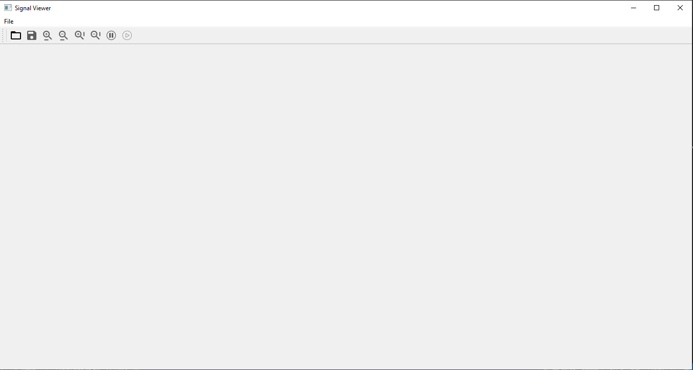

# signalViewer
this program designed to show a recorded biological data (ECG,EMG,EOG,EEG,..etc) and there spectograms to help doctors to analyse these data
using three channels
## file format
it accepts .csv files 
## screen 

